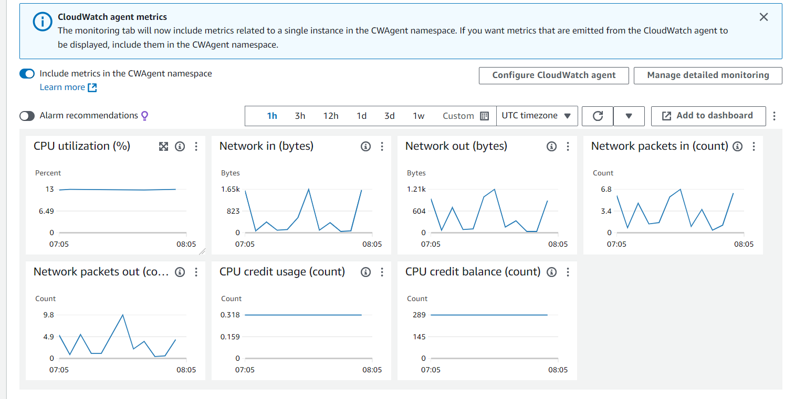
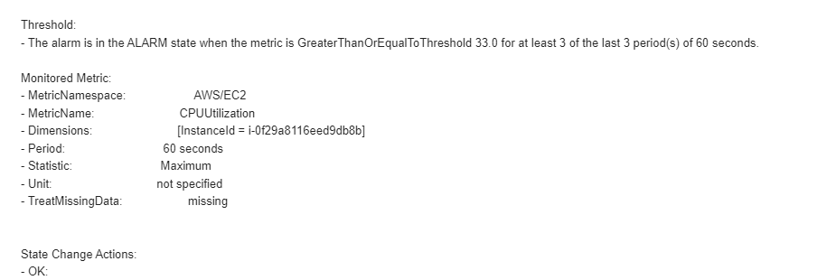

# DEVOPS

- This repo contain CD pipeline for k8s deployment using FluxCD/ArgoCD.

## File Structure

- File structure for CD pipeline is as follows:
```
├───cluster-1
│   └───flux-system
    └───app1
└───cluster-2
│   └───flux-system
    └───app2
```

## Cloud Watch Logs/ Dashboard


## SNS Notification Image
